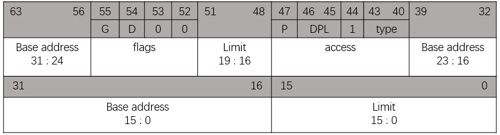

# 一、CPU的工作模式（寻址方式）
说GDT需要从CPU的工作模式开始说，在`IA32`架构（或称`i386`、`X86-32`或`X86`架构）下，CPU有多种工作模式：实模式和保护模式。

CPU复位（reset）或加电（power on）的时候以实模式启动，处理器以实模式工作。在实模式下，内存寻址方式和8086相同，由16位段寄存器的内容乘以16(左移4位)当做段基地址，加上16位偏移地址形成20位的物理地址，最大寻址空间1MB，最大分段64KB。可以使用32位指令。32位的x86 CPU用做高速的`8086`。在实模式下，所有的段都是可以读、写和可执行的。

286架构导入保护模式，允许硬件等级的存储器保护。然而要使用这些新的特色，需要额外先前不需要的软件指令。由于x86微处理机主要的设计规格，是能够完全地向前兼容于针对先前所有x86芯片所撰写的软件，因此286芯片的开机是处于’实模式’—也就是关闭新的存储器保护特性的模式，所以可以运行针对旧的微处理器所设计的软件。到现在为止，即使最新的x86 CPU一开始在电源打开处于实模式下，也能够运行针对先前任何芯片所撰写的软件.

在`8086/8088`时期，都是16位的CPU，没有工作模式之分，有16位的寄存器，16位的数据总线，20位的地址总线，使用`Segment:Offset`寻址方式，具有1MB的寻址能力。

在`80286`以后出现实模式和保护模式的区别，实模式主要是为了兼容之前的CPU架构，可以运行之前的软件，寻址方式和寻址能力和`8086` CPU相同。依照CPU的设计规则，之后的`X86` CPU都是在实模式下启动。

而到了`Intel 80386`，CPU真正具有32位的寄存器，32位的地址总线，一个寄存器就具有具有4GB的寻址能力。但为了兼容80x86之前的机器，`8086`以后的机器启动后仍然进入实模式下，由16位段寄存器左移4位作为基地址加上16位偏移地址形成20位的物理地址，最大寻址空间1MB，最大分段64KB。之后需要手动的切换到保护模式下。

保护模式与实模式相比，主要是两个差别：一是提供了段间的保护机制，防止程序间胡乱访问地址带来的问题，二是访问的内存空间变大，`80386`具有32位寄存器，寻址可达到4GB。

# 二、GDT
GDT，即全局描述表（`GDT Global Descriptor Table`）。

在保护模式下仍然使用Segment:Offset的寻址方式，但其中的含义有所不同。

首先考虑一下在实模式下的编程模型：

在实模式下，对内存地址的访问是通过`Segment:Offset`的方式来进行的，其中`Segment`是段的`Base Address`，一个`Segment`的最大长度是64 KB，这是16-bit系统所能表示的最大长度。而`Offset`则是相对于`Base Address`的偏移量。`Base Address + Offset`就是一个内存绝对地址。由此，我们可以看出，一个段具备两个因素：`Base Address`和`Limit`（段的最大长度），而对一个内存地址的访问，则是需要指出：使用哪个段？以及相对于这个段`Base Address`的`Offset`，这个`Offset`应该小于此段的Limit。当然对于16-bit系统，Limit不要指定，默认为最大长度64KB，而 16-bit的Offset也永远不可能大于此Limit。在实际编程的时，使用16-bit段寄存器CS(`Code Segment`)，DS(`Data Segment`)，SS(`Stack Segment`)来指定Segment，CPU将段寄存器中的数值向左偏移4-bit，放到20-bit的地址线上就成为20-bit的`Base Address`。

到了保护模式，内存的管理模式分为两种：段模式和页模式，其中页模式也是基于段模式的。也就是说，保护模式的内存管理模式事实上是：纯段模式和段页式。进一步说，段模式是必不可少的，而页模式则是可选的——如果使用页模式，则是段页式；否则是纯段模式。

既然是这样，我们就先不去考虑页模式。对于段模式来讲，访问一个内存地址仍然使用`Segment:Offset`的方式。由于保护模式运行在32位系统上，那么`Segment`的两个因素：`Base Address`和Limit也都是32位的。IA-32允许将一个段的`Base Address`设为32-bit所能表示的任何值（Limit则可以被设为32-bit所能表示的，以2^12为倍数的任何值），而不象实模式下，一个段的Base Address只能是16的倍数（因为其低4-bit是通过左移运算得来的，只能为0，从而达到使用16-bit段寄存器表示20-bit Base Address的目的），而一个段的Limit只能为固定值64 KB。另外，保护模式，顾名思义，又为段模式提供了保护机制，也就说一个段的描述符需要规定对自身的访问权限（`Access`）。所以，在保护模式下，对一个段的描述则包括3方面因素：`[Base Address, Limit, Access]`，它们加在一起被放在一个64-bit长的数据结构中，被称为段描述符。这种情况下，如果我们直接通过一个64-bit段描述符来引用一个段的时候，就必须使用一个64-bit长的段寄存器装入这个段描述符。但Intel为了保持向后兼容，将段寄存器仍然规定为16-bit（尽管每个段寄存器事实上有一个64-bit长的不可见部分，但对于程序员来说，段寄存器就是16-bit的），那么很明显，我们无法通过16-bit长度的段寄存器来直接引用64-bit的段描述符。怎么办？

解决的方法就是把这些长度为64-bit的段描述符放入一个数组中，而将段寄存器中的值作为下标索引来间接引用（事实上，是将段寄存器中的高13-bit的内容作为索引）。这个全局的数组就是GDT。事实上，在GDT中存放的不仅仅是段描述符，还有其它描述符，它们都是64-bit长，我们随后再讨论。

GDT可以被放在内存的任何位置，那么当程序员通过段寄存器来引用一个段描述符时，CPU必须知道GDT的入口，也就是基地址放在哪里，所以Intel的设计者门提供了一个寄存器GDTR用来存放GDT的入口地址，程序员将GDT设定在内存中某个位置之后，可以通过LGDT指令将GDT的入口地址装入此寄存器，从此以后，CPU就根据此寄存器中的内容作为GDT的入口来访问GDT了。

GDT是保护模式所必须的数据结构，也是唯一的——不应该，也不可能有多个。另外，正象它的名字（`Global Descriptor Table`）所揭示的，它是全局可见的，对任何一个任务而言都是这样。

# 三、IDT

`Interrupt Descriptor Table`用于存放中断描述符的表

段描述符使用数组存储，使用LIDT指令将IDT的入口地址装入IDTR寄存器。